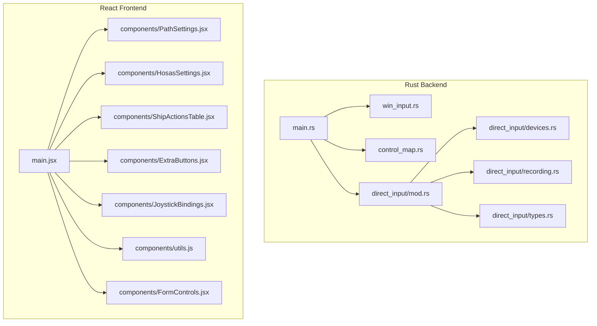

# AbsoluteHOTAS Configurator

A premium desktop companion application built with **Tauri v2** and **React** for configuring the `AbsoluteHOTAS.ini` file and synchronizing your custom key bindings with Starfield's binary `ControlMap_Custom.txt` layout.

Designed explicitly for the AbsoluteHOTAS input mod, this configurator allows you to easily map your flight controls, calibrate joystick sensitivities, manage HOSAS modes, configure additional raw buttons, and prevent input conflicts.

---

## Key Features

### 🛠️ Configurator Core
- **Load & Save `AbsoluteHOTAS.ini`**: Full support for hardware, buttons, normalization, injection, and ship-button configurations.
- **💾 Profile Backups & Management**: Create separate backup profiles (`.ini`) and load them dynamically using native file browser dialogs to swap control schemes instantly.
- **Native DirectInput Scanning**: Arms a noise-resilient recording thread to listen for your next vJoy joystick button press or deliberate analog axis deflection.
- **Visual INI Preview**: Built-in side drawer lets you inspect the raw INI content generated in real-time.

### 🎮 HOSAS & Advanced Calibration
- **Detent Calibration**: Direct control over deadzones, idle plateaus, poll rates, and unipolar throttles.
- **Mutually Exclusive HOSAS Modes**:
  - **Incremental Throttle Mode (Deflection)**: For deflection-based analog throttle controls.
  - **Keyboard Emulation Mode (W/S Pulse)**: Emulates tap patterns for responsive control.
- **Ramping Rate**: Customize deflection throttling ramp rates for experimental setups.
- **Always On Mode**: Keep mappings continuously active.
- **Reverse Axis Memory Injection**: Toggle separate sliders, deadzones, activation limits, and active telemetry hooks.

### 🛰️ Ship Controls & Output Bindings
- **Full Ship Action Matrix**: Map 23 named spaceship events (Boosters, weapons, system power allocation, etc.) to your joystick buttons.
- **⚡ Auto-Map Unused Keys**: Decouple ship controls from on-foot controls with a single click. Assigns 23 completely unique, safe secondary keyboard keys (such as `Numpad 7`, `[`, `;`, etc.) to prevent double-binding conflicts.
- **Output Recording**: Keep the vanilla Starfield output as `Default`, or record a keyboard/mouse output that replaces the vanilla SendInput binding in `AbsoluteHOTAS.ini`.
- **Duplicate & Collision Alerts**: Warns you instantly in real-time if a chosen scancode or button is already bound elsewhere or conflicts with a vanilla preset.

### ➕ Extra Passthrough Buttons
- **Collapsible panel**: Expands on demand to map arbitrary joystick buttons (1-128) directly to scancode overrides outside of the primary ship layout.
- **Defaults to Collapsed**: Keeps the dashboard sleek and clean upon launch.

### 💾 Binary ControlMap Synchronization
- **Direct Custom Patching**: Reads, parses, structurally merges, and writes your output bindings directly to Starfield's custom binary mapping file: `ControlMap_Custom.txt`.
- **Secondary-Only Override Patching**: Writes *only* the custom secondary records (`Flags: 0x02 0x00`) to preserve Starfield's default layout database in the primary column (ensuring vanilla keyboard controls like `Space`, `Q`, `E` never get unbound).
- **Automatic Backups**: Generates a `.bak` backup file on every save to ensure you never lose your previous configurations.
- **Deduplication Engine**: Backend logic strips duplicate mappings within identical contexts to prevent desyncs during spaceflight.

---

## Folder Modularity Layout
Both the frontend and the Tauri backend have been modularized into cohesive, single-responsibility files of **under 500 lines** for extremely fast compilation, clean code reviews, and high readability:



---

## Binding Workflow

1. **Load Configuration**: Choose your active `AbsoluteHOTAS.ini` and `ControlMap_Custom.txt` using the native file browser dials, and click **Load**.
2. **Device Connection**: Confirm that the vJoy summary panel successfully displays your active DirectInput channel.
3. **Manage Profiles (Optional)**: Click **Create Backup Profile** to save your current configuration under a separate backup profile, or **Load Backup Profile** to quickly restore a previously saved control scheme.
4. **⚡ Auto-Map (Recommended)**: Click **⚡ Auto-Map Unused Keys** and confirm the modal to instantly decouple flight bindings from on-foot controls using 23 safe, conflict-free secondary keyboard hotkeys.
5. **Capture Inputs**: 
   - Choose a known control from the axis/button dropdowns, or click **Bind**.
   - Deflect your analog axis or tap a button to bind it in real-time.
6. **Set Up Outputs**: Toggle vanilla presets, define key scancodes, or click **Rec** to record secondary keyboard/mouse inputs.
7. **Deduplicate & Save**: Click **Save Config** to write the active INI, generate a `.bak` copy of your control map, and structurally serialize your bindings to Starfield's custom layout database!

---

## Build Requirements

- **Operating System**: Windows 10/11
- **Driver Setup**: Installed and configured vJoy joystick driver virtual channels.
- **Runtimes**: Microsoft Edge WebView2 (standard on modern Windows).
- **Toolchain**: Node.js (v18+) and Rust (stable toolchain) are required ONLY if compiling from source.

### Building From Source

Use `npm.cmd` on Windows shells where standard execution policies restrict PowerShell scripts:

```powershell
# 1. Install required packages
npm.cmd install

# 2. Start the hot-reloading development client
npm.cmd run tauri dev

# 3. Compile the production-ready standalone setup executable
npm.cmd run tauri build
```

The output executable packages everything into a secure, portable, and fast desktop dashboard setup.

---

## License

This project is licensed under the MIT License. See `LICENSE` for the complete license terms.
